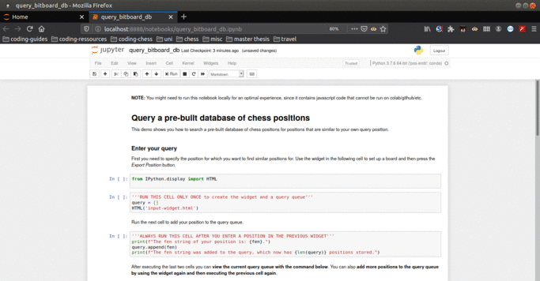
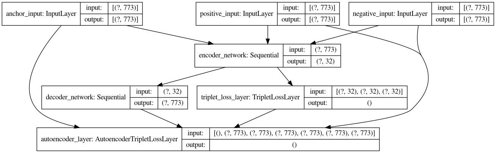

# chesspos: embedding learning for chess positions
Embedding based chess position search and embedding learning for chess positions

This repository allows you to search a chess position against billions of chess positions in millions of games and retrieve similar positions. You can also build your own database with the provided tools. Additionally The projects experiments with embeddings learned from bitboards using the triplet neural network architecture. Feel free to try out your own embedding models to improve the embedding based search retrieval.

## Guide

1. Install the package
2. Demo: Search your positions in a provided database
3. Extract positions from your own database for search and metric learning
4. Train and evaluate chess position embeddings
5. Experiment and Contribute
6. Cite this project

## 1. Install the package

Make sure you have python3 installed. You will also need the following packages:
- [h5py](https://github.com/h5py/h5py) to read and write large chunks of data
- [python-chess](https://github.com/niklasf/python-chess) for parsing chess games
- [faiss](https://github.com/facebookresearch/faiss) for billion scale nearest neighbor search

and numpy.

Additionally for the metric learning part of this project you will need [tensorflow (v2)](https://www.tensorflow.org/).

All packages except for faiss can be pip installed. To install faiss either use anaconda, e.g.

```conda install faiss-cpu -c pytorch```

or follow alternative instructions like [here](https://gist.github.com/korakot/d0a49d7280bd3fb856ae6517bfe8da7a) or [here](https://stackoverflow.com/questions/47967252/installing-faiss-on-google-colaboratory).

Finally pip install this package from source.
```
git clone https://github.com/patrickfrank1/chesspos.git
cd chesspos
python -m pip install .
# test if installation was successful, the following should run without error
python -c "import chesspos"
```
Congratulations you have successfully installed the package. It contains the following modules:
- `chesspos.binary_index`: functions for loading and searching of bitboards in faiss,
- `chesspos.convert`: convert between different chess position encodings like fen, bitboards and chess.Board(),
- `chesspos.embedding_index`: functions for loading and searching embeddings in faiss,
- `chesspos.models`: tensorflow models for embedding learning,
- `chesspos.monitoring`: function to monitor metric learning progress, in particular callback to track triplet classification accuracy,
- `chesspos.pgnextract`: functions to extract and save bitboards from pgn files,
- `chesspos.preprocessing`: prepare triplet generators for metric learning,
- `chesspos.utils`: general purpose functions.

Furthermore this repository contains folders for tests, demos, command line tools and data files.

## 2. Demo: Search your positions in a provided database

Now that you installed the package you can ckeck out the demo notebook at [./demo/query_bitboard_db.ipynb](./demo/query_bitboard_db.ipynb) or see some [examples live in your browser](https://mybinder.org/v2/gh/patrickfrank1/chesspos/6e9ec55ccab91ed9bd23c9f1a80e3b981c466c2a?filepath=demo%2Fquery_bitboard_example.ipynb).



The demo enables you to search a small database of bitbaords for similar positions. I provide some more precompiled databases. The following databases contain high quality games that are generated from [freely available lichess games](https://database.lichess.org/), where we only extracted games with both players above elo 2000 and a time control greater or equal 60+1 seconds.

|          file/link              | positions [million] | download size | RAM needed |
|:-------------------------------:|:-------------------:|:-------------:|:----------:|
| [index_2013.faiss.bz2][1]       |                 1.7 |         12 MB |     171 MB |
| [index_2014.faiss.bz2][2]       |                11.5 |         80 MB |     1.2 GB |
| [index_2015.faiss.bz2][3]       |                  47 |        324 MB |     4.6 GB |
| [index_2020_01_02.faiss.bz2][5] |                 510 |        3.6 GB |      50 GB |

[1]:https://chess-position-files.s3.amazonaws.com/index/index_2013.faiss.bz2
[2]:https://chess-position-files.s3.amazonaws.com/index/index_2014.faiss.bz2
[3]:https://chess-position-files.s3.amazonaws.com/index/index_2015.faiss.tar.bz2
[5]:https://chess-position-files.s3.amazonaws.com/index/index_2020_01_02.faiss.bz2

However, as you can find out by playing with the notebook the similarity search with bitboards is not optimal, this is why we explore metric learning later on.

## 3. Extract positions from your own database for search and metric learning

The `tools` folder provides useful command line scripts to preprocess pgn files that contain chess positions. If you are stuck display the help with `python3 path/to/tool.py -h`.

#### 3.1 Extract positions

To extract bitboards from all positions of all games in a pgn file open a terminal in the tools foder and run:
```bash
python3 pgn_extract.py ../data/raw/test.pgn --save_position ../data/bitboards/test-bb1.h5
```

This command takes as input the path to you pgn file and wirtes the bitboards to an h5 file at the path specified via `--save_position`. Note: you can drop the .pgn and .h5 file endings and the program will still parse the right files. To ease the file writing process and occupy less ram you can use the `--chunksize` flag, so that your data will be written in chunks, e.g `--chunksize 10000`.

We can also utilize this script to extract tuples of positions for metric learning, to do so run:
```bash
python3 pgn_extract.py ../data/raw/test --save_position ../data/bitboards/test-bb1 --tuples True --save_tuples ../data/train_small/test2-tuples-strong
```
This will extract tuples from each game by virtue of the method `tuple_generator` in `chesspos.pgnextract`. Each generated tuple has the shape (15, 773) and contains a randomly sampled position of each game i *game[i][j]* and randomly sampled positions from the next game as
```
tuple = (game[i][j], game[i][j+1], game[i][j+2], game[i][j+3], game[i][j+4], game[i][(j+14) mod len(game[i])], game[i+1][rand1], ..., game[i+1][rand9])
```

Furthermore the command line script implements two simple filters to subsample  big pgn files. For example
```bash
python3 pgn_extract.py ../data/raw/test --save_position ../data/bitboards/test-bb2 --chunksize 10000 --tuples True --save_tuples ../data/train_small/test2-tuples-strong --filter elo_min=2400 --filter time_min=61
```
selects only games in which both players have an elo greater or equal to 2400 and where the time control is greater or equal to 61. The time control is calculated as *seconds + seconds per move*, which means a bullet game (60s+0s) is discarded whereas a bullet game with increment (60s+1s) is kept.

#### 3.2 Build a faiss database from bitboards for search

Use the following script to create a binary index from positions encoded as bitboards.
```bash
python3 index_from_bitboards.py ../data/bitboards/testdir --table_key position_ --save_path ../data/test_index2
```
This command will take all h5 files from the `../data/bitboards/testdir` directory and extract bitboards from all datasets in all h5 files which contain `position_` in their dataset name. The recommended (and also default) value is *position* since bitboards created with the tool in section 3.1 use this name for bitboard datasets. The finished index is saved to `../data/test_index2` and can be used as in the [demo notebook](./demo/query_bitboard_db.ipynb).

## 4. Train and evaluate chess position embeddings

#### 4.1 Embedding model

First I tried a simple triplet network architecture to learn a position embedding. This however quickly turned out to be a too simple approach. Instead, I propose a triplet autoencoder architecture, as presented in Figure 1, to learn chess position embeddings.

While desingning the network architecture I also  took inspiration from [Courty, Flamary, Ducoffe: Learning Wasserstein Embeddings](https://github.com/mducoffe/Learning-Wasserstein-Embeddings) and [CrimyTheBold/tripletloss](https://github.com/CrimyTheBold/tripletloss).



The idea behind this architecture is inspired by word embeddings like word2vec in that subsequent positions in embedding space are similar and should therefore have similar embeddings. This is what the triplet network learns. However this implicit classification discards a lot of information that is encoded in the chess position and therefore I introduced the autoencoder to ensure tha the position's information is encoded in the embedding and to act as a regularizer.

I provide two models, which are trained on more than 50 million triplets:
- with shallow encoder/decoder networks to 128 dimensions [here](https://chess-position-files.s3.amazonaws.com/model/shallow128.tar.bz2)
- with deep encoder/decoder networks to 64 dimensions [here](https://chess-position-files.s3.amazonaws.com/model/deep64.tar.bz2)

as well as some [training triplets (11G)](https://chess-position-files.s3.amazonaws.com/tuples/train.tar.bz2) and [validation triplets (1.4G)](https://chess-position-files.s3.amazonaws.com/tuples/validation.tar.bz2). You can genearte your own training data with the script in section **3.1**.

For inference use the `model_inference.py` command line script from `tools`. This script takes a directory with bitboards stored in h5 files and appends the infereed embeddings to those h5 files. These files are then used to create an index as discussed in section **4.3**.


#### 4.2 Train your own embeddings

You can train your own embeddings using a similar architecture (but different encoder/decoder networks using the `train_model.py` command line script in `tools` 
```bash
python3 train_model.py path/to/config.json
```
where the config file has fields (and default values)
```json
{
	"train_dir": "path/to/directory/with/train/samples",
	"validation_dir": "path/to/directory/with/validation/samples",
	"save_dir": "path/to/save/directory",
	"input_size": 773,
	"embedding_size": 32,
	"alpha": 0.2,
	"triplet_weight_ratio": 10.0,
	"hidden_layers": [],
	"train_batch_size": 16,
	"validation_batch_size": 16,
	"train_steps_per_epoch": 1000,
	"validation_steps_per_epoch": 100,
	"train_sampling": ["easy","semihard","hard"],
	"validation_sampling": ["easy","semihard","hard"],
	"tf_callbacks": ["early_stopping","triplet_accuracy", "checkpoints"],
	"save_stats": true,
	"hide_tf_warnings": true
}
```
`àlpha` is the seaparation margin between positive and negative samples in the triplet loss, `triplet_weigth_ration` is a hyperparameter that combines triplet loss and autoencoder loss by weighting the triplet loss e.g. 10 times higher and `training_sampling` selects the way in which triplets are sampled from the provided tuples. To get a better understanding of what is going on cosider looking at `tools/train_model.py`, `chesspos/models.py`, `chesspos/preprocessing.py` and `chesspos/monitoring.py`.

#### 4.3 Build a faiss database from embeddings

Take your trained model (or alternatively one of the two provided above) and generate embeddings for a database of bitboards (stored in h5 files). I provide the `model_inference.py` script for embedding generation in the `tools` folder to be used like that:
```bash
python3 model_inference.py path/to/model path/to/bitboard/files
```
optionally you can save the inferred embeddings as float16 values (saves 50% memory on disk) with the `--float16 True` flag, you can specify a batch size with e.g. `--batch_size 4096`, specify the table prefix for the bitboard tables with `--table_prefix` (the default is *position*) and specify a prefix for the embedding tables `--embedding_table_prefix` (the default is *test_embedding*). **Warning: the h5 files with bitboards are updated in-place, an embedding table is added for each bitboard table.**

Then you use the `index_from_embedding.py` script from the `tools` folder on those generated embeddings. This will create an index file that is drastically smaller than then stored embeddings such that the index can be searched in RAM!
```bash
python3 index_from_embedding.py PCA16,SQ4 path/to/embeddings
```
where `PCA16,SQ4` can be any valid [faiss index factory](https://github.com/facebookresearch/faiss/wiki/The-index-factory) string and the second argument is the path to the previously written embedding files. For additional info open he manual with `python3 index_from_embedding.py -h`.

The index compresses the embeddings, in case of `PCA32,SQ4` to 16 bytes per position whhich is much smaller than 92 bytes per embedding for a bitboard. In that way the database can comprise many more positions. However, the nearest positions cannot be retrieved from the index itself but have to be retrieved from file instead. If you provide the files that were used to create the index, then you will be able to retrieve the bitboards of nearest positions as well as the embeddings themselfes. For a demonstration see [./demo/inspect_embeddings.ipynb](./demo/inspect_embeddings.ipynb).

Since the embedding files require a large amount of disk space you can also delete the embeddding tables or provide the original h5 files that only store the bitboards. These files will be much smaller on disk, but you will unly be able to restore the bitboards and not the embeddings. For a demo check out [./demo/query_bitboard_db.ipynb](./demo/query_bitboard_db.ipynb) again.

I also provide links to some precompiled indices below with bitboards and embeddings (use with demo scripts).

| Embedding model  | Positions    | Indices         | Bitboards                                                      |
|------------------|--------------|-----------------|----------------------------------------------------------------|
| [shallow 128][6] | 1.7 million  | [2013_s128][7]  | [2013_bitboards][8]                                            |
| [deep 64][9]     | 1.7 million  | [2013_d64][10]  | [2013_bitboards][8]                                            |
| [shallow 128][6] | 11.5 million | [2014_s128][11] | [2014_bitboards][12]                                           |
| [deep 64][9]     | 11.5 million | [2014_d64][13]  | [2014_bitboards][12]                                           |
| [shallow 128][6] | 907 million  | [all_s128][14]  | [2013_bitboards][8]+[2014_bitboards][12]+[other_bitboards][15] |
| [deep 64][9]     | 907 million  | [all_d64][16]   | [2013_bitboards][8]+[2014_bitboards][12]+[other_bitboards][15] |

[6]:https://chess-position-files.s3.amazonaws.com/model/shallow128.tar.bz2
[7]:https://chess-position-files.s3.amazonaws.com/index/2013_s128.tar
[8]:https://chess-position-files.s3.amazonaws.com/bitboards/2013_bitboards.tar.bz2
[9]:https://chess-position-files.s3.amazonaws.com/model/deep64.tar.bz2
[10]:https://chess-position-files.s3.amazonaws.com/index/2013_d64.tar
[11]:https://chess-position-files.s3.amazonaws.com/index/2014_s128.tar
[12]:https://chess-position-files.s3.amazonaws.com/bitboards/2014_bitboards.tar.bz2
[13]:https://chess-position-files.s3.amazonaws.com/index/2013_d64.tar
[14]:https://chess-position-files.s3.amazonaws.com/index/all_s128.tar
[15]:https://chess-position-files.s3.amazonaws.com/bitboards/other_bitboards.tar.bz2
[16]:https://chess-position-files.s3.amazonaws.com/index/all_d64.tar

## 5. Experiment and Contribute

If you like this project and want to extend it then there are two main challenges to solve as outlined in the chapters above. You can focus on embedding learning or on embedding compression.

A few ideas to improve embedding learning:
- sample triplets/tuples in a different way (e.g. from openings / endgames to improve search for that particular part of the game)
- tune the triplet-autoencoder hyperparameters, encoder structure, ...
- come up with a better neural network architecture for metric learning

A few ideas for improving embedding compression:
- test different faiss indices, find best compression/accuracy tradeoff
- try inverted file indices

Other things:
- retrieve games that belong to the retrieved positions (information is all there)
- calculate triplet accuracy as tf metric insted of tf callback
- expose position search as api

## 6. Cite this project

If you use this project in your work, please consider citing it.
```
@misc{frank2020chesspos,
title={chesspos: embedding learning for chess positions},
author={Frank, Patrick},
url={https://github.com/patrickfrank1/chesspos},
year={2020},
month={04}
}
```
 #### License
 
This project is licensed under the terms of the GNU GPLv3.0 license.
