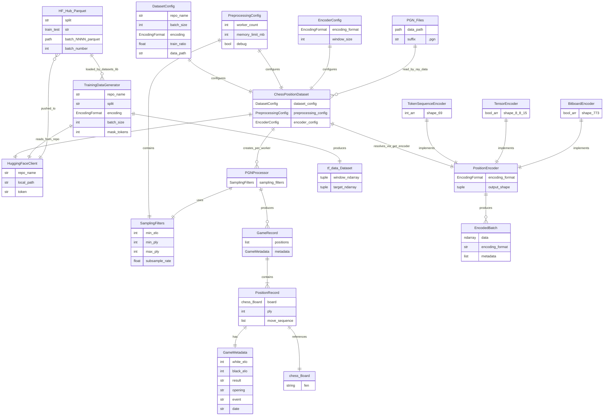

# Chess Position Dataset Pipeline

This document explains how chess position data is processed end-to-end, from raw
PGN files on disk to a `tf.data.Dataset` consumed by Keras training. It covers
the entities that make up the `src/dataset/` package, their relationships, and
the runtime flow driven by `src/run/generate_hf_dataset.py`.

The pipeline has two decoupled halves that meet at a HuggingFace Hub dataset
repository:

- **Write side** (`etl.py` + `pgn_processor.py` + `position_encoder.py`):
  Ray-backed ETL that reads PGN, samples/encodes positions, and pushes Parquet
  shards to the Hub.
- **Read side** (`data_loader.py`): pulls the Parquet back from the Hub into a
  `tf.data.Dataset`, with optional MLM-style masking.

---

## Entity-Relationship Diagram



---

## Runtime Flow

```
generate_hf_dataset.py
  ├── parse CLI args + YAML  ──►  DatasetConfig / PreprocessingConfig / EncoderConfig
  └── ChessPositionDataset.generate(num_batches, resume, dry_run)
        │
        ▼  (Ray Data cluster, worker_count CPUs)
   1. READ      ray.data.read_binary_files(*.pgn)
   2. EXTRACT   _extract_positions ── PGNProcessor.extract_game(game)
        │         ├── SamplingFilters._passes_elo_filter (logistic ELO gating)
        │         └── _should_sample_position (ply² × subsample_rate)
        │         emits dict{fen, ply, white_elo, black_elo, result} per position
   3. LIMIT     positions.limit(batch_size)
   4. ENCODE    _encode_batch ── get_encoder(encoding_format).encode_batch(boards)
        │         ├── token_sequence → int8 (69,)
        │         ├── tensor          → bool (8,8,15)
        │         └── bitboard        → bool (773,)
   5. SPLIT     ray.data.Dataset.train_test_split(train_ratio) → (train_ds, test_ds)
   6. PUSH      _push_batch ── write_parquet(tempdir) → HfApi.upload_file
        │         path_in_repo = f"{split}/batch_{NNNN}_{name}.parquet"
        │         (skipped when --dry-run)
        ▼
   HuggingFace Hub dataset repo (Parquet shards, batch-numbered)
        │
        ▼
   TrainingDataGenerator.to_tf_dataset(streaming=True)
        ├── datasets.load_dataset(repo_name, split=…)
        ├── optional _apply_mask (BERT-style MLM with mask_token_id=16)
        └── tf.data.Dataset → shuffle → batch → prefetch  ──►  Keras training
```

---

## Component Responsibilities

### Configuration (`config.py`)

Plain `@dataclass` objects with `__post_init__` validation. They are the only
inputs to the orchestrator and thread through every stage:

- `DatasetConfig` — what to build (`repo_name`, `batch_size`, `encoding`,
  `train_ratio`, `data_path`).
- `PreprocessingConfig` — how to build it (`worker_count`, `memory_limit_mb`,
  `debug`) and embeds `SamplingFilters`.
- `SamplingFilters` — game/position gating: `min_elo`, `min_ply`, `max_ply`,
  `subsample_rate`.
- `EncoderConfig` — `encoding_format` + `window_size` (the latter is currently
  consumed by the loader-side windowing, not the ETL).

### Domain types (`types.py`)

In-memory representations only; never persisted directly. The ETL flattens
these into dict rows before encoding.

- `GameMetadata` — PGN header fields (ELOs, result, opening, event, date).
- `PositionRecord` — `board` (a `chess.Board`), `ply`, `metadata`,
  `move_sequence`.
- `GameRecord` — a list of `PositionRecord`s sharing one `GameMetadata`.
- `EncodedBatch` — numpy array + encoding format + metadata list (used by
  encoders' batch APIs; not currently flowed through the ETL itself).
- `EncodingFormat` is just a `str` alias; the three constants
  (`TOKEN_SEQUENCE`, `TENSOR`, `BITBOARD`) index `ENCODING_SHAPES`.

### PGN processing (`pgn_processor.py`)

`PGNProcessor` is the chess-aware layer. It can iterate files/directories or
operate on a single `chess.pgn.Game` (the path used by the ETL, where Ray
already handles file distribution):

- `_extract_metadata` parses headers; `_parse_elo` tolerates `"?"`/garbage.
- `_passes_elo_filter` uses a **logistic** acceptance probability on
  `min(white_elo, black_elo)` centred at `min_elo` — games near the threshold
  are probabilistically included rather than hard-cut.
- `_extract_positions` walks the mainline, respecting `min_ply`/`max_ply`, and
  yields a `PositionRecord` per accepted move.
- `_should_sample_position` samples with probability
  `(ply/30)² × subsample_rate`, so early plies are aggressively down-weighted
  (openings are over-represented in PGN corpora).
- `extract_temporal_windows` is an alternative API yielding fixed-length
  `list[PositionRecord]` sliding windows — currently unused by the ETL but
  aligned with the loader's window-shaped expectations.

### Position encoders (`position_encoder.py`)

Abstract `PositionEncoder` with `encode`/`encode_batch`/`decode`/`decode_batch`
and a registry:

- `TokenSequenceEncoder` — 64 piece tokens + 5 status tokens (turn + 4 castling
  rights), dtype `int8`, shape `(69,)`. Vocabulary reserves ids 15 (`empty`),
  16 (`mask`), 17–28 (pieces), 29–30 (turn), 31–32 (castling). This is the
  default and the format the loader is wired for.
- `TensorEncoder` — `8×8×15` boolean tensor (12 piece planes + castling +
  en-passant + turn).
- `BitboardEncoder` — flat `773`-bool vector (12×64 + 5 status bits).

`get_encoder(format)` instantiates from the registry; `register_encoder` allows
extension.

### ETL orchestrator (`etl.py`)

`ChessPositionDataset` is the write-side entry point:

- `generate(num_batches, resume, dry_run)` is a generator that initialises Ray
  (`local_mode=debug`), iterates batches, and yields `(train_ds, test_ds)` per
  batch as `ray.data.Dataset`s.
- `_process_batch` is the Ray pipeline:
  `read_binary_files → flat_map(_extract_positions) → limit(batch_size) →
  map_batches(_encode_batch) → train_test_split(train_ratio)`.
- `_extract_positions` and `_encode_batch` are static so Ray can pickle them as
  plain functions; each worker reconstructs its own `PGNProcessor` /
  `PositionEncoder`.
- `_push_batch` writes Parquet to a temp dir and uploads each shard via
  `HfApi.upload_file` to `{split}/batch_{NNNN:04d}_{name}.parquet`. Resume
  support comes from `HuggingFaceClient.get_next_batch_number()`, which lists
  repo files and increments the max batch id.
- `create_dataset_card` renders a Markdown card with the encoding shape and a
  usage snippet; pushed via `HuggingFaceClient.push_dataset_card`.

### HuggingFace client (`huggingface_client.py`)

Thin wrapper around `HfApi`:

- Authenticates on construction (`whoami`).
- `push_batch` / `create_version_tag` / `get_existing_batches` /
  `get_next_batch_number` manage the repo contents and numbering.
- `create_dataset_card` / `push_dataset_card` render and upload a README.

Note: `ChessPositionDataset._push_batch` currently bypasses
`HuggingFaceClient.push_batch` and talks to `HfApi` directly (writing Parquet
from Ray first), because Ray already materialises the data as files. The client
is still used for resume lookups and the dataset card.

### Training data loader (`data_loader.py`)

`TrainingDataGenerator` is the read-side counterpart:

- `to_tf_dataset(streaming=True)` uses `datasets.load_dataset(..., streaming=…)`
  and wraps it in a `tf.data.Dataset` via `from_generator`.
- Output signature is `(tf.int8[None, 69], tf.int8[None, 69])` — i.e. windowed
  token sequences, where the input and target are identical unless masking is
  applied.
- `_apply_mask` implements BERT-style masking: per position, randomly selects
  `mask_tokens` of the 69 indices and replaces them with `mask_token_id=16`.
- `with_transformation` / `with_masking` / `with_split` return derived
  generators (functional, non-mutating), and `on_epoch_end` re-shuffles.

---

## Key Takeaways

- **Two-stage lifecycle**: `etl.py` (write side, Ray-backed ETL → HF Hub
  Parquet) and `data_loader.py` (read side, HF Datasets → `tf.data.Dataset`)
  are decoupled by the HuggingFace Hub repo (`DatasetConfig.repo_name`). Any
  encoding-format change requires regenerating the dataset.
- **Sampling is probabilistic and ply-aware**: `PGNProcessor` gates games by a
  logistic ELO function and samples positions with probability
  `(ply/30)² × subsample_rate`, so deeper moves are over-represented relative
  to openings.
- **Three encoders share the `PositionEncoder` ABC** and a registry
  (`get_encoder`); the same `EncodingFormat` string threads through config →
  ETL → dataset card → loader.
- **`ChessPositionDataset` is the orchestrator**: it composes the three configs
  + `HuggingFaceClient`, drives Ray, and owns the per-batch Parquet push.
  Resume support comes from `HuggingFaceClient.get_next_batch_number()`
  scanning existing shards.
- **`TrainingDataGenerator` is a thin consumer**: it re-reads the Parquet from
  the Hub, optionally masks tokens (for MLM-style training, `mask_token_id=16`),
  and yields `(window, window)` pairs shaped `(None, 69)` — matching the
  `token_sequence` encoder's 69-token output.

---

## Known Schema Mismatch

`ChessPositionDataset._encode_batch` writes columns named `encoded`, `ply`,
`white_elo`, `black_elo`, and `result` — i.e. one encoded position per row plus
metadata. However, `TrainingDataGenerator._streaming_to_tf_dataset` reads
columns named `window` and `scalars` and emits `(None, 69)` windows.

These names and shapes do not line up. The loader appears to target a different
(or older) dataset schema based on temporal windows (see
`PGNProcessor.extract_temporal_windows`), whereas the current ETL produces
single encoded positions with metadata. Reconciling this — either by having the
ETL emit windowed rows, or by having the loader consume single-position rows —
is a prerequisite for end-to-end training off the generated dataset.
