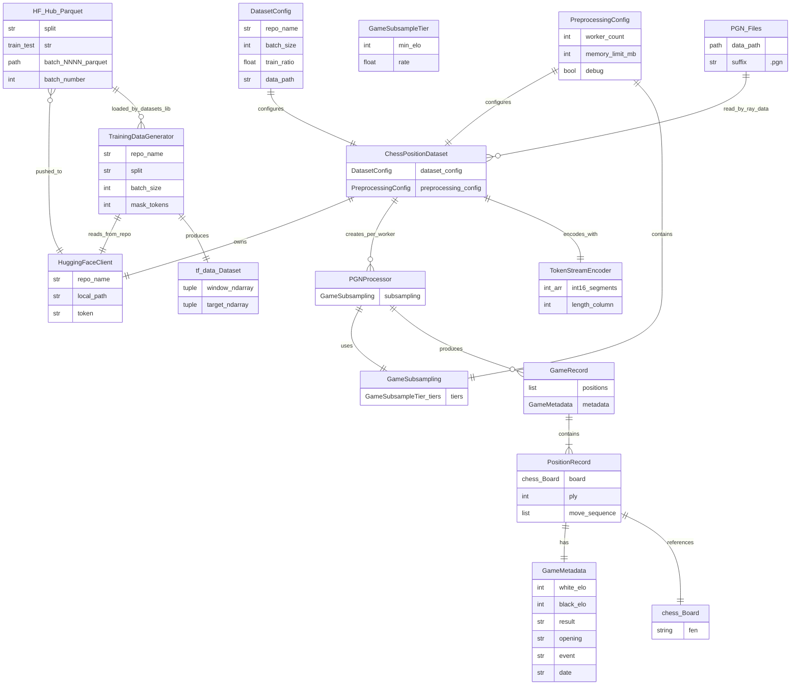

# Chess Position Dataset Pipeline

This document explains how chess position data is processed end-to-end, from raw
PGN files on disk to a `tf.data.Dataset` consumed by Keras training. It covers
the entities that make up the `src/dataset/` package, their relationships, and
the runtime flow driven by `src/run/generate_hf_dataset.py`.

The pipeline has two decoupled halves that meet at a HuggingFace Hub dataset
repository:

- **Write side** (`etl.py` + `pgn_processor.py` + `position_encoder.py`):
  Ray-backed ETL that reads PGN, samples/encodes positions, and pushes Parquet
  shards to the Hub.
- **Read side** (`data_loader.py`): pulls the Parquet back from the Hub into a
  `tf.data.Dataset`, with optional MLM-style masking.

---

## Entity-Relationship Diagram


```mermaid
erDiagram
    %% ---- Configuration entities ----
    DatasetConfig ||--|| ChessPositionDataset : configures
    PreprocessingConfig ||--|| ChessPositionDataset : configures
    PreprocessingConfig ||--|| GameSubsampling : contains

    DatasetConfig {
        str repo_name
        int batch_size
        float train_ratio
        str data_path
    }
    GameSubsampling {
        GameSubsampleTier_tiers tiers
    }
    GameSubsampleTier {
        int min_elo
        float rate
    }
    PreprocessingConfig {
        int worker_count
        int memory_limit_mb
        bool debug
    }

    %% ---- Domain entities ----
    GameRecord ||--|{ PositionRecord : contains
    PositionRecord ||--|| GameMetadata : has
    PositionRecord ||--|| chess_Board : references

    GameMetadata {
        int white_elo
        int black_elo
        str result
        str opening
        str event
        str date
    }
    PositionRecord {
        chess_Board board
        int ply
        list move_sequence
    }
    GameRecord {
        list positions
        GameMetadata metadata
    }
    chess_Board {
        string fen
    }

    %% ---- Processing components ----
    ChessPositionDataset ||--|| HuggingFaceClient : owns
    ChessPositionDataset ||--o{ PGNProcessor : creates_per_worker
    ChessPositionDataset ||--|| TokenStreamEncoder : encodes_with
    PGNProcessor ||--|| GameSubsampling : uses
    PGNProcessor ||--o{ GameRecord : produces

    ChessPositionDataset {
        DatasetConfig dataset_config
        PreprocessingConfig preprocessing_config
    }
    PGNProcessor {
        GameSubsampling subsampling
    }
    TokenStreamEncoder {
        int_arr int16_segments
        int length_column
    }
    HuggingFaceClient {
        str repo_name
        str local_path
        str token
    }

    %% ---- Consumption / training side ----
    TrainingDataGenerator ||--|| HuggingFaceClient : reads_from_repo
    TrainingDataGenerator ||--|| tf_data_Dataset : produces

    TrainingDataGenerator {
        str repo_name
        str split
        int batch_size
        int mask_tokens
    }
    tf_data_Dataset {
        tuple window_ndarray
        tuple target_ndarray
    }

    %% ---- External artifacts ----
    PGN_Files ||--o{ ChessPositionDataset : read_by_ray_data
    HF_Hub_Parquet }o--|| HuggingFaceClient : pushed_to
    HF_Hub_Parquet ||--o{ TrainingDataGenerator : loaded_by_datasets_lib

    PGN_Files {
        path data_path
        str suffix ".pgn"
    }
    HF_Hub_Parquet {
        str split train_test
        str path batch_NNNN_parquet
        int batch_number
    }
```

---

## Runtime Flow

```
generate_hf_dataset.py
  ├── parse CLI args + YAML  ──►  DatasetConfig / PreprocessingConfig
  └── ChessPositionDataset.generate(num_batches, resume, dry_run)
        │
        ▼  (Ray Data cluster, worker_count CPUs)
   1. READ      ray.data.read_binary_files(*.pgn)
   2. EXTRACT   _extract_positions ── PGNProcessor.extract_game(game)
         │         ├── _keep_game: tiered game subsampling by player strength
         │         └── _extract_positions: every mainline position (no sampling)
         │         emits one dict row per game:
         │         {fens, n_positions, ply, game_id, white_elo, black_elo, result}
   3. LIMIT     games.limit(batch_size)   (caps games, not positions)
   4. ENCODE    _encode_batch ── TokenStreamEncoder().encode(board) per position
         │         → pack_stream(segments, add_cls=True) → 1-D int16 per game
         │         + split column via hash(game_id) vs train_ratio
   5. SPLIT     materialize() → filter(split == "train" / "test")
   6. PUSH      _push_batch ── write_parquet(tempdir) → HfApi.upload_file
        │         path_in_repo = f"{split}/batch_{NNNN}_{name}.parquet"
        │         (skipped when --dry-run)
        ▼
   HuggingFace Hub dataset repo (Parquet shards, batch-numbered)
        │
        ▼
   TrainingDataGenerator.to_tf_dataset(streaming=True)
        ├── datasets.load_dataset(repo_name, split=…)
        ├── optional _apply_mask (BERT-style MLM with mask_token_id=16)
        └── tf.data.Dataset → shuffle → batch → prefetch  ──►  Keras training
```

---

## Component Responsibilities

### Configuration (`config.py`)

Plain `@dataclass` objects with `__post_init__` validation. They are the only
inputs to the orchestrator and thread through every stage:

- `DatasetConfig` — what to build (`repo_name`, `batch_size`, `train_ratio`,
  `data_path`).
- `PreprocessingConfig` — how to build it (`worker_count`, `memory_limit_mb`,
  `debug`) and embeds `GameSubsampling` and `TimeControlFilter`.
- `GameSubsampling` — tiered game subsampling by player strength: a list of
  `GameSubsampleTier(min_elo, rate)` entries. A game is assigned to the
  strictest tier whose `min_elo` both players meet and kept with probability
  `rate`; games with missing ratings only qualify for the `min_elo=0`
  catch-all tier.
- `TimeControlFilter` — hard filter (not stochastic) that excludes games whose
  TimeControl header parses to a base time below `min_seconds` (default 300s,
  i.e. bullet games). Games with missing/unparseable time control are kept;
  set `min_seconds=None` to disable.

### Domain types (`types.py`)

In-memory representations only; never persisted directly. The ETL flattens
these into dict rows before encoding.

- `GameMetadata` — PGN header fields (ELOs, result, opening, event, date,
  time control).
- `PositionRecord` — `board` (a `chess.Board`), `ply`, `metadata`,
  `move_sequence`.
- `GameRecord` — a list of `PositionRecord`s sharing one `GameMetadata`.

### PGN processing (`pgn_processor.py`)

`PGNProcessor` is the chess-aware layer. It can iterate files/directories or
operate on a single `chess.pgn.Game` (the path used by the ETL, where Ray
already handles file distribution):

- `_extract_metadata` parses headers; `_parse_elo` tolerates `"?"`/garbage.
- `_keep_game` applies tiered game subsampling (`GameSubsampling`): the game's
  strength is `min(white_elo, black_elo)` (missing ratings count as 0); it is
  matched against the strictest qualifying tier and kept with that tier's
  `rate` probability.
- `_extract_positions` walks the mainline and yields a `PositionRecord` for
  **every** position — no position-level subsampling (that belongs to
  training-time data selection now).
- `extract_temporal_windows` is an alternative API yielding fixed-length
  `list[PositionRecord]` sliding windows — currently unused by the ETL but
  aligned with the loader's window-shaped expectations.

### Token stream encoder (`token_stream.py`)

The only encoder, hardcoded into the ETL (no ABC, no registry, no config).
Variable-length `int16` token segments:

- Vocabulary: `PAD=0, MASK=1, SEP=2, CLS=3`, `TURN_WHITE=4`, `TURN_BLACK=5`,
  `CASTLE_BASE=6` (base + 4-bit rights mask → 6–21), `EP_BASE=22` (base +
  square index → 22–37, only when en passant is *legal*), `PIECE_SQUARE_BASE=38`
  (base + 64·piece_index + square → 38–805), `VOCAB_SIZE=806`.
- Segment layout: `TURN CASTLE [EP] piece-square*` with piece tokens sorted by
  square ascending (canonical order).
- `encode_batch` returns `(padded (N, L) int16, lengths (N,) int32)`.
- `decode`/`decode_batch` invert the encoding (round trip is exact against
  `board.epd()`; halfmove/fullmove counters are not encoded).
- `pack_stream(segments, add_cls=True)` concatenates segments with `SEP`
  (prefixed by `CLS`) into a single 1-D `int16` sequence. The ETL uses this to
  emit **one packed row per game**; no truncation is applied, so long games
  produce proportionally long rows.

### ETL orchestrator (`etl.py`)

`ChessPositionDataset` is the write-side entry point:

- `generate(num_batches, resume, dry_run)` is a generator that initialises Ray
  (`local_mode=debug`), iterates batches, and yields `(train_ds, test_ds)` per
  batch as `ray.data.Dataset`s.
- `_process_batch` is the Ray pipeline:
  `read_binary_files → flat_map(_extract_positions) → limit(batch_size) →
  map_batches(_encode_batch, batch_format="pyarrow") → materialize() →
  filter(split)`. The split is decided per game by `_split_for_game`
  (`hash(game_id) < train_ratio`), so all positions of a game land in the same
  split and the row-level `train_test_split` (which caused train/test leakage
  and scattered game positions) is gone. `batch_size` caps **games** per batch,
  not positions.
- `_game_id` derives a stable id from the PGN identifying headers
  (`Event|Site|Date|Round|White|Black`, sha1, truncated to 16 hex chars) —
  deterministic across runs and workers (unlike Python's builtin `hash`).
- `_extract_positions` and `_encode_batch` are static so Ray can pickle them as
  plain functions; each worker reconstructs its own `PGNProcessor` /
  `TokenStreamEncoder`.
- `_push_batch` writes Parquet to a temp dir and uploads each shard via
  `HfApi.upload_file` to `{split}/batch_{NNNN:04d}_{name}.parquet`. Resume
  support comes from `HuggingFaceClient.get_next_batch_number()`, which lists
  repo files and increments the max batch id.
- `create_dataset_card` renders a Markdown card with the encoding shape and a
  usage snippet; pushed via `HuggingFaceClient.push_dataset_card`.

### HuggingFace client (`huggingface_client.py`)

Thin wrapper around `HfApi`:

- Authenticates on construction (`whoami`).
- `push_batch` / `create_version_tag` / `get_existing_batches` /
  `get_next_batch_number` manage the repo contents and numbering.
- `create_dataset_card` / `push_dataset_card` render and upload a README.

Note: `ChessPositionDataset._push_batch` currently bypasses
`HuggingFaceClient.push_batch` and talks to `HfApi` directly (writing Parquet
from Ray first), because Ray already materialises the data as files. The client
is still used for resume lookups and the dataset card.

### Training data loader (`data_loader.py`)

`TrainingDataGenerator` is the read-side counterpart:

- `to_tf_dataset(streaming=True)` uses `datasets.load_dataset(..., streaming=…)`
  and wraps it in a `tf.data.Dataset` via `from_generator`.
- Output signature is `(tf.int8[None, 69], tf.int8[None, 69])` — i.e. windowed
  token sequences, where the input and target are identical unless masking is
  applied.
- `_apply_mask` implements BERT-style masking: per position, randomly selects
  `mask_tokens` of the 69 indices and replaces them with `mask_token_id=16`.
- `with_transformation` / `with_masking` / `with_split` return derived
  generators (functional, non-mutating), and `on_epoch_end` re-shuffles.

---

## Key Takeaways

- **Two-stage lifecycle**: `etl.py` (write side, Ray-backed ETL → HF Hub
  Parquet) and `data_loader.py` (read side, HF Datasets → `tf.data.Dataset`)
  are decoupled by the HuggingFace Hub repo (`DatasetConfig.repo_name`).
- **Subsampling is game-level and tiered**: `PGNProcessor` keeps every position
  of an accepted game (position selection belongs to training) and accepts
  games by strength tier — the strictest `GameSubsampleTier(min_elo, rate)`
  both players qualify for decides acceptance with probability `rate`.
- **One encoder, no abstraction**: the `TokenStreamEncoder` in
  `token_stream.py` is instantiated directly by the ETL. There is no
  `PositionEncoder` ABC, registry, or encoder config to thread through.
- **`ChessPositionDataset` is the orchestrator**: it composes the two configs
  + `HuggingFaceClient`, drives Ray, and owns the per-batch Parquet push.
  Resume support comes from `HuggingFaceClient.get_next_batch_number()`
  scanning existing shards.
- **`TrainingDataGenerator` is a thin consumer**: it re-reads the Parquet from
  the Hub, optionally masks tokens (for MLM-style training, `mask_token_id=16`),
  and yields `(window, window)` pairs shaped `(None, 69)` — matching the
  `token_sequence` encoder's 69-token output.

---

## Known Schema Mismatch

The ETL now writes one row per game with columns `packed` (1-D ragged int16
token stream, CLS-prefixed, positions separated by SEP), `n_positions`, `ply`,
`game_id`, `white_elo`, `black_elo`, `result`, and `split`. However,
`TrainingDataGenerator._streaming_to_tf_dataset` still reads columns named
`window` and `scalars` and emits `(None, 69)` windows.

The loader must be updated to consume per-game packed rows (unpack/segment the
`packed` stream, or slice windows from it). Until then, end-to-end training off
the generated dataset is not possible.
